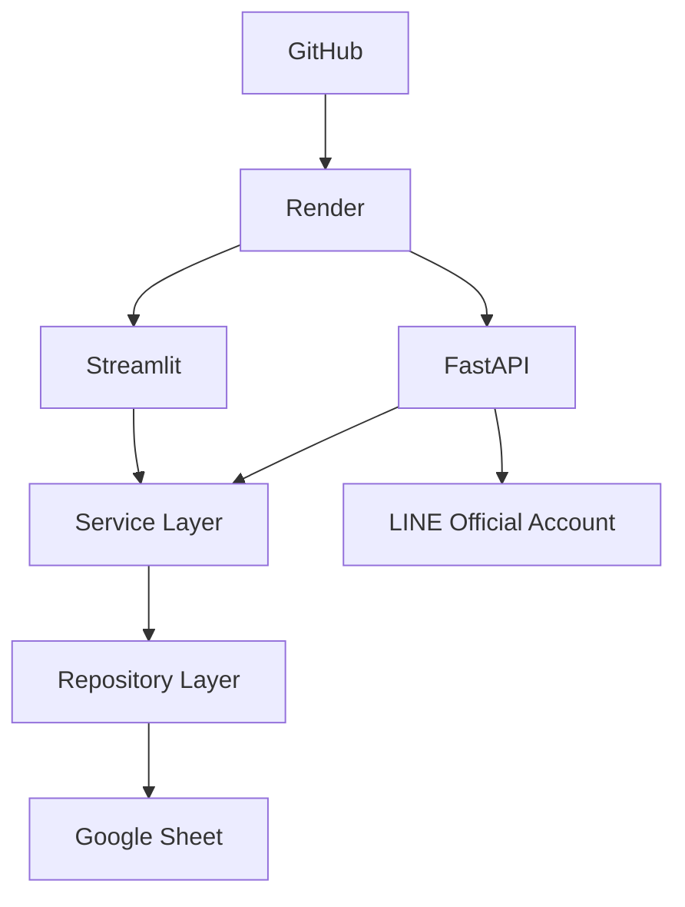

# 🚀 Engineer Department Platform

> Enterprise Engineering Management Platform


---

# Project Overview

Engineer Department Platform 是一套以 **Streamlit + FastAPI + Google Sheet** 為核心的企業級工程管理平台。

V5.3.0 新增 11 個工程課別。側邊欄先選擇課別後，任務、行事曆、甘特圖、效率分析、會議、簽核與公告均只顯示該課別資料；人員指派選單也只載入該課別成員。開發者面板可新增、刪除、停用人員及調整角色權限。

目前版本：

**V5.1.1 Enterprise Diagnostics Center**

## 已完成功能

- Dashboard
- 任務管理
- 艾森豪矩陣
- 甘特圖
- 行事曆
- 公告中心
- Google Sheet 同步
- FastAPI API
- LINE Official Account
- Enterprise Diagnostics

---

# System Architecture

```text
                GitHub
                   │
             Render Deploy
        ┌──────────┴──────────┐
        │                     │
   Streamlit UI          FastAPI API
        │                     │
        └──────────┬──────────┘
                   │
            Service Layer
                   │
          Repository Layer
                   │
             Google Sheet
                   │
        LINE Official Account
```

## Mermaid



---

# Project Structure

```text
app.py
pages/
api/
repositories/
services/
components/
config/
shared/
utils/
assets/

render-api.yaml
render-streamlit.yaml
requirements.txt
README.md
```

---

# Quick Start

```bash
git clone https://github.com/<your-account>/Engineer_Department_platform.git
cd Engineer_Department_platform
pip install -r requirements.txt
streamlit run app.py
```

API

```bash
uvicorn api.main:app --reload
```

---

# Render Deployment

兩個 Render Service：

| Service | Purpose |
|---------|---------|
| engineer-department-platform | Streamlit UI |
| engineer-department-api | FastAPI API |

---

# Environment Variables

```env
APP_NAME=
APP_VERSION=
ENVIRONMENT=

STREAMLIT_BASE_URL=
API_BASE_URL=

GOOGLE_SHEET_ID=
GOOGLE_SERVICE_ACCOUNT_JSON=

LINE_CHANNEL_SECRET=
LINE_CHANNEL_ACCESS_TOKEN=

OPENAI_API_KEY=
```

---

# Google Sheet

需要建立：

- Users
- Tasks
- Announcements
- Meetings
- Approvals
- Categories
- Tags

---

# API

| Method | Endpoint |
|---------|----------|
| GET | /health |
| GET | /ready |
| GET | /api/tasks |
| GET | /api/users |
| GET | /api/announcements |
| GET | /api/line/status |
| POST | /api/line/webhook |
| POST | /api/line/webhook-test |

---

# Enterprise Diagnostics

Developer Mode 可檢查：

- Google Sheet
- LINE Official Account
- Render API
- AI Service

---

# Roadmap

| Version | Status |
|----------|--------|
| V5.1.1 Enterprise Diagnostics | ✅ |
| V5.1.2 LINE User Binding | Planned |
| V5.2 AI Assistant | Planned |
| V5.3 Gmail & Calendar | Planned |
| V5.4 Scheduler | Planned |
| V6 Database Migration | Planned |

---

# License

MIT License

Copyright (c) Engineer Department Platform
