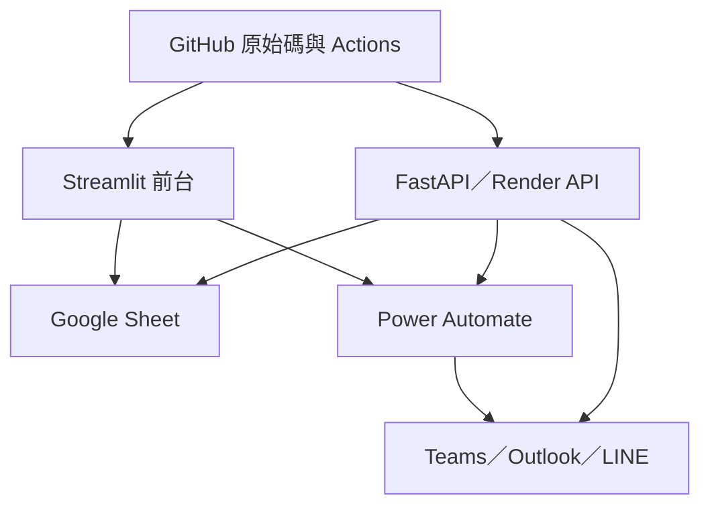

# 開發工程部平台

以 Streamlit、FastAPI 與 Google Sheet 建置的工程部門協作平台，整合任務、會議、簽核、人員、公告與 Microsoft 365／LINE 通知。

[](#目前版本)
[](https://www.python.org/)
[](https://streamlit.io/)
[](https://fastapi.tiangolo.com/)
[](#通知整合)
[](#通知整合)

> 正式平台：[https://engineer-department-platform.streamlit.app/](https://engineer-department-platform.streamlit.app/)

## 目前版本

**V5.6.0 — Microsoft 365 Notifications Foundation**

目前正式組織範圍以「工程一部」為主，下轄「儀電規劃課」與「程序規劃課」。程式仍保留可擴充的部門／課別設定，方便後續逐步納入其他單位。

本版本重點：

- Teams 個別通知改由 Power Automate 逐位發送
- Teams 個別通知固定使用 `recipient`、`title`、`message` JSON
- Outlook、Teams 與 LINE 多管道通知
- Microsoft 365 人員同步基礎
- Webhook 錯誤狀態與回應內容記錄
- Streamlit 前台與 FastAPI 後端分離部署

## 主要功能

| 模組 | 功能 |
| --- | --- |
| 首頁／公告 | 企業公告、到期下架、置頂顯示、附件與通知 |
| 任務看板 | 待辦、進行中、已完成、指派對象、優先度與進度 |
| 艾森豪矩陣 | 依重要性與急迫性呈現四象限任務 |
| 專案行事曆 | 依日期檢視任務與專案時程 |
| 專案甘特圖 | 專案排程、期間與進度視覺化 |
| 效率統計 | 任務完成率、逾期與工作效率分析 |
| 會議系統 | 會議建立、與會者選擇及會前提醒 |
| 簽核中心 | 請假／簽核資料與多管道通知 |
| 人員名單 | 部門、課別、職務、權限及 Microsoft 365 帳號 |
| 開發者診斷 | Google Sheet、LINE、API 與通知服務狀態檢查 |

任務指派與會議與會者可跨部門選擇，並支援全選或依單一部門／課別選取。人員排序以主要職務權限為準，兼任職務不影響排序。

## 系統架構


```mermaid
flowchart TD
    GH["GitHub 原始碼與 Actions"]
    UI["Streamlit 前台"]
    API["FastAPI／Render API"]
    DATA["Google Sheet"]
    FLOW["Power Automate"]
    MSG["Teams／Outlook／LINE"]

    GH --> UI
    GH --> API
    UI --> DATA
    UI --> FLOW
    API --> DATA
    API --> FLOW
    FLOW --> MSG
    API --> MSG
```

- **Streamlit**：操作介面與各業務功能頁面
- **FastAPI**：健康檢查、通知、同步及自動化端點
- **Google Sheet**：人員、任務、公告、會議與簽核資料
- **Power Automate**：Teams 個別訊息與 Outlook 郵件
- **GitHub Actions**：服務喚醒、人員同步與會議提醒

## 專案結構

```text
.
├─ app.py                         # Streamlit 主入口
├─ streamlit_app.py               # 相容入口
├─ pages/
│  ├─ 1_任務看板.py
│  ├─ 2_艾森豪矩陣.py
│  ├─ 3_專案行事曆.py
│  ├─ 4_專案甘特圖.py
│  ├─ 5_效率統計分析.py
│  ├─ 6_會議系統.py
│  ├─ 7_簽核中心.py
│  └─ 8_人員名單.py
├─ api/                           # FastAPI 應用、路由與中介層
├─ services/                      # 商業邏輯與外部服務整合
├─ repositories/                  # Google Sheet 資料存取
├─ components/                    # 共用畫面元件
├─ config/                        # 版本、角色、部門與環境設定
├─ line_handlers/                 # LINE 指令處理
├─ scripts/m365_sync.py           # Microsoft 365 人員同步
├─ .github/workflows/             # 自動化工作流程
├─ docs/                          # 架構、部署、API 與維運文件
├─ requirements.txt
├─ render-api.yaml
└─ render-streamlit.yaml
```

## 快速啟動

### 1. 取得專案

```bash
git clone https://github.com/<你的帳號>/<你的儲存庫>.git
cd <你的儲存庫>
```

### 2. 建立環境並安裝套件

```bash
python -m venv .venv
```

Windows PowerShell：

```powershell
.\.venv\Scripts\Activate.ps1
python -m pip install -r requirements.txt
```

macOS／Linux：

```bash
source .venv/bin/activate
python -m pip install -r requirements.txt
```

### 3. 設定環境變數

複製 `.env.example` 為 `.env`，再填入開發環境需要的設定。正式密鑰請放在部署平台的 Secrets／Environment，不可提交至 GitHub。

```env
APP_NAME=Engineer Department Platform
APP_VERSION=V5.6.0 Microsoft 365 Notifications Foundation
ENVIRONMENT=development
LOG_LEVEL=INFO

STREAMLIT_BASE_URL=
API_BASE_URL=

GOOGLE_SHEET_ID=
GOOGLE_SERVICE_ACCOUNT_JSON=

LINE_CHANNEL_SECRET=
LINE_CHANNEL_ACCESS_TOKEN=

TEAMS_WEBHOOK_URL=
M365_BULLETIN_WEBHOOK_URL=
OUTLOOK_WEBHOOK_URL=
M365_WEBHOOK_TOKEN=

OPENAI_API_KEY=
```

### 4. 啟動

Streamlit：

```bash
streamlit run app.py
```

FastAPI：

```bash
uvicorn api.main:app --reload
```

啟動後可開啟：

- Streamlit：`http://localhost:8501`
- FastAPI 文件：`http://localhost:8000/docs`
- 健康檢查：`http://localhost:8000/health`

## Google Sheet

平台依目前功能使用下列工作表：

- `Users`
- `Tasks`
- `Announcements`
- `Meetings`
- `Approvals`
- `Categories`
- `Tags`

Google Service Account 必須具有目標試算表的存取權。請勿將 Service Account JSON 或私鑰提交至儲存庫。

## 通知整合

### Teams 個別通知

平台向 Power Automate Webhook 逐位傳送：

```json
{
  "recipient": "user@example.com",
  "title": "通知標題",
  "message": "通知內容"
}
```

`recipient` 必須是 Microsoft 365／Teams 可辨識的登入帳號。平台優先使用人員資料中的 Email，並可使用 `m365_upn` 作為替代。

部署時請特別確認：

1. Power Automate 流程為「開啟」狀態。
2. `TEAMS_WEBHOOK_URL` 指向目前仍存在的流程。
3. Streamlit 與 Render 若都會發送通知，兩邊必須同步設定最新 URL。
4. 測試成功後才從正式任務、會議或簽核功能發送。

若 Logs 出現 `WorkflowTriggerIsNotEnabled` 或流程狀態為 `Deleted`，代表平台仍指向已停用或已刪除的舊 Webhook。

### Teams 布告欄

布告欄使用獨立的 `M365_BULLETIN_WEBHOOK_URL`，保留 Adaptive Card 格式，請勿與個別通知 Webhook 混用。

### Outlook 與 LINE

- Outlook：透過 `OUTLOOK_WEBHOOK_URL` 呼叫 Power Automate
- LINE：透過 LINE Official Account Channel Secret 與 Access Token 發送
- 任務、會議、簽核可依功能設定採用多管道通知

## API 摘要

| 方法 | 路徑 | 用途 |
| --- | --- | --- |
| `GET` | `/health` | API 健康檢查 |
| `GET` | `/ready` | 就緒狀態 |
| `GET` | `/api/info` | 系統資訊 |
| `GET` | `/api/service-status` | 外部服務狀態 |
| `GET` | `/api/tasks` | 任務清單 |
| `GET` | `/api/users` | 人員清單 |
| `GET` | `/api/announcements` | 公告清單 |
| `POST` | `/api/line/webhook` | LINE Webhook |
| `GET` | `/api/notifications/status` | Microsoft 365 通知狀態 |
| `POST` | `/api/notifications/teams/test` | Teams 測試 |
| `POST` | `/api/notifications/outlook/test` | Outlook 測試 |
| `POST` | `/api/m365/users/sync` | Microsoft 365 人員同步 |
| `POST` | `/api/meetings/reminders/run` | 執行會議提醒 |

完整互動式 API 文件請使用 FastAPI `/docs`。

## GitHub Actions

| Workflow | 用途 | 觸發方式 |
| --- | --- | --- |
| `keep-alive.yml` | 喚醒 Streamlit 與 Render API | 每 10 分鐘／手動 |
| `m365-sync.yml` | 同步 Microsoft 365 人員 | 手動 |
| `meeting-reminders.yml` | 發送次日會議提醒 | 每日台灣時間 08:00／手動 |

Microsoft 365 同步所需 GitHub Secrets：

- `M365_TENANT_ID`
- `M365_CLIENT_ID`
- `M365_CLIENT_SECRET`
- `M365_WEBHOOK_TOKEN`

選用 Repository Variable：

- `M365_GROUP_ID`

## 部署

目前架構可使用：

- Streamlit Community Cloud：前台
- Render：FastAPI
- GitHub Actions：排程工作

部署前請依序確認：

1. Google Sheet 與 Service Account 權限正常。
2. Streamlit Secrets 已設定前台會使用的密鑰。
3. Render Environment 已設定 API 會使用的密鑰。
4. Power Automate Webhook URL 未失效，相關流程均為開啟。
5. GitHub Secrets 已完成 Microsoft 365 同步與會議提醒設定。
6. `/health`、平台診斷、Teams、Outlook 與 LINE 測試皆成功。

> Render 與 Streamlit 免費方案仍可能休眠或重啟；Keep Alive 僅能降低休眠機率，不能保證永久在線。

## 安全注意事項

- 不可提交 `.env`、Streamlit Secrets、Webhook URL、Token 或 Service Account 私鑰。
- Power Automate Webhook URL 應視同密碼；若外洩，請立即重建或輪替。
- 不要在 Issues、截圖、Logs 或 README 中公開完整密鑰。
- Microsoft Entra Client Secret 最長期限到期前應提早更換。
- 正式環境應限制 CORS、API 測試端點與管理功能的存取權。

## 相關文件

詳細文件位於 [`docs/`](docs/)：

- [系統架構](docs/01_Architecture.md)
- [安裝說明](docs/02_Installation.md)
- [Render 部署](docs/03_Render_Deployment.md)
- [Google Sheet 設定](docs/04_Google_Sheet.md)
- [LINE Official Account](docs/05_LINE_Official_Account.md)
- [API 文件](docs/06_API_Document.md)
- [開發者指南](docs/07_Developer_Guide.md)
- [診斷與故障排除](docs/08_Diagnostics.md)
- [變更紀錄](docs/10_Changelog.md)
- [安全指南](docs/13_Security.md)
- [部署檢查表](docs/14_Deployment_Checklist.md)
- [Microsoft 365 通知](docs/16_Microsoft365_Notifications.md)

## 目前狀態

- ✅ Streamlit 平台正式運作
- ✅ Render FastAPI 部署
- ✅ Google Sheet 資料整合
- ✅ LINE Official Account 通知
- ✅ Outlook 通知流程
- ✅ Teams 個別通知程式格式
- ✅ Teams 布告欄獨立流程
- ✅ GitHub Actions 服務喚醒與會議提醒
- ⚠️ 部署後仍須確認 Streamlit 與 Render 的 Webhook URL 均為最新有效流程
- ⏳ AI Service 目前僅保留介面，尚未啟用正式 AI 回答

## 授權

本專案目前供內部開發與維運使用。若要對外公開，請先補上正式授權條款與敏感資料檢查。
