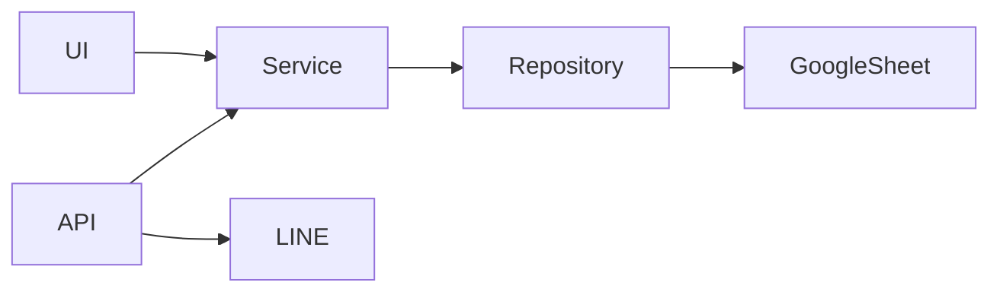

# 01 Architecture

## Overall Architecture

```text
GitHub
   │
Render
 ┌─┴──────────────┐
 │                │
Streamlit UI   FastAPI API
 │                │
 └──────┬─────────┘
        │
   Service Layer
        │
 Repository Layer
        │
 Google Sheet
        │
LINE Official Account
```

## Layer Responsibilities

| Layer | Responsibility |
|---|---|
| Streamlit | Enterprise UI |
| FastAPI | REST API / LINE Webhook |
| Services | Business logic |
| Repository | Data access |
| Google Sheet | Persistent storage |

## Data Flow



## Current Version

- V5.5.3 Microsoft 365 Migration Baseline
- Streamlit + FastAPI dual service
- Repository Pattern
- Enterprise Diagnostics
